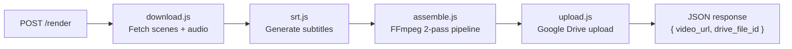

# ffmpeg-service

A self-contained Node.js microservice that assembles short-form vertical videos (9:16) from individual scene clips, overlays subtitles, mixes in background audio, and uploads the finished MP4 to Google Drive.

## Architecture



**Render pipeline (per job):**

1. **Download** — each scene video from its public URL; audio from Google Drive by file ID  
2. **SRT** — build a subtitle file with cumulative timecodes from scene captions  
3. **Assemble** — FFmpeg two-pass:  
   - Pass 1: trim, scale to 1080×1920, pad with black for each scene  
   - Pass 2: concatenate scenes, mix audio, burn subtitles → final MP4  
4. **Upload** — push MP4 to a Google Drive folder, set public sharing  
5. **Cleanup** — delete all temp files for the job (always, even on failure)

---

## Quick Start (Docker)

```bash
# 1. Build
docker build -t ffmpeg-service .

# 2. Run
docker run --rm -p 3001:3001 \
  -e GOOGLE_DRIVE_FOLDER_ID=your_folder_id \
  -v /path/to/service_account.json:/run/secrets/service_account.json:ro \
  ffmpeg-service
```

Or with **Docker Compose** — add to your `docker-compose.yml`:

```yaml
services:
  ffmpeg-service:
    build: .
    ports:
      - "3001:3001"
    environment:
      - GOOGLE_DRIVE_FOLDER_ID=${GOOGLE_DRIVE_FOLDER_ID}
      - GOOGLE_SERVICE_ACCOUNT_JSON=/run/secrets/service_account.json
    secrets:
      - service_account

secrets:
  service_account:
    file: ./service_account.json
```

Then run:

```bash
docker compose up --build
```

---

## Environment Variables

| Variable | Required | Description |
|---|---|---|
| `PORT` | No | Server port (default: `3001`) |
| `GOOGLE_SERVICE_ACCOUNT_JSON` | Yes | Absolute path to the Google service-account JSON key file |
| `GOOGLE_DRIVE_FOLDER_ID` | Yes | Target Google Drive folder ID for uploads |

Copy `.env.example` to `.env` and fill in your values.

---

## API Reference

### `GET /health`

Liveness probe.

**Response** `200 OK`

```json
{
  "status": "ok",
  "timestamp": "2025-01-15T12:00:00.000Z"
}
```

---

### `POST /render`

Submit a reel for rendering.

**Request body:**

```json
{
  "reel_id": "reel_XXXXXXXXX",
  "total_seconds": 45,
  "audio_drive_file_id": "GOOGLE_DRIVE_FILE_ID",
  "scenes": [
    {
      "scene_number": 1,
      "video_url": "https://videos.pexels.com/...",
      "caption": "Did you know AI can now Google things before answering?",
      "duration_seconds": 15
    },
    {
      "scene_number": 2,
      "video_url": "https://videos.pexels.com/...",
      "caption": "It's called Grounding — and it changes everything.",
      "duration_seconds": 15
    },
    {
      "scene_number": 3,
      "video_url": "https://videos.pexels.com/...",
      "caption": "Follow for more AI tips!",
      "duration_seconds": 15
    }
  ]
}
```

| Field | Type | Description |
|---|---|---|
| `reel_id` | string | Unique identifier for this reel |
| `total_seconds` | number | Desired total video length |
| `audio_drive_file_id` | string | Google Drive file ID for the background audio |
| `scenes` | array | Ordered list of scenes |
| `scenes[].scene_number` | number | Scene index (informational) |
| `scenes[].video_url` | string | Public URL to the source video clip |
| `scenes[].caption` | string | Subtitle text for this scene |
| `scenes[].duration_seconds` | number | How long this scene should be |

**Success response** `200 OK`

```json
{
  "success": true,
  "video_url": "https://drive.google.com/file/d/.../view?usp=sharing",
  "drive_file_id": "1AbCdEfGhIjKlMnOpQrStUvWxYz"
}
```

**Error response** `400` or `500`

```json
{
  "success": false,
  "error": "Descriptive error message"
}
```

---

## File Structure

```
ffmpeg-service/
├── Dockerfile
├── package.json
├── .env.example
├── README.md
└── src/
    ├── server.js      Express app & entry point
    ├── render.js       Orchestration pipeline
    ├── download.js     URL + Google Drive file downloaders
    ├── assemble.js     FFmpeg command builder & executor
    ├── upload.js       Google Drive uploader
    └── srt.js          SRT subtitle file generator
```

---

## Local Development (without Docker)

```bash
cd ffmpeg-service
npm install

# Make sure ffmpeg is on your PATH
ffmpeg -version

# Set env vars
export GOOGLE_SERVICE_ACCOUNT_JSON=/path/to/service_account.json
export GOOGLE_DRIVE_FOLDER_ID=your_folder_id

npm start
# → ffmpeg-service listening on port 3001
```
